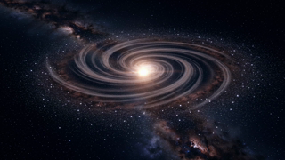
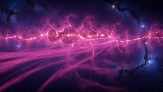
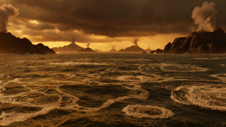
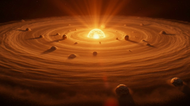
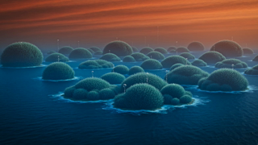
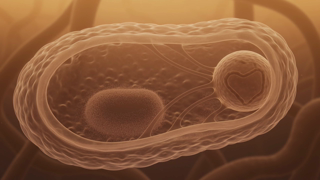
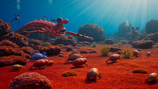

<p align="center">
  
</p>

<h1 align="center">Manim Evolution Story — Reimagined with Grok Imagine</h1>

> **Project Status: ARCHIVED — Experiment Complete**

<p align="center">
  <a href="https://www.manim.community/"></a>
  <a href="https://x.ai"></a>
  <a href="LICENSE"></a>
  <a href="https://github.com/NullLabTests/manim-evolution-story"></a>
  <br>
  <a href="https://github.com/NullLabTests/manim-evo-story-reimagined/commits/main"></a>
  <a href="https://github.com/NullLabTests/manim-evo-story-reimagined"></a>
</p>

---

## About

This was an experiment: take the existing [Manim Evolution Story](https://github.com/NullLabTests/manim-evolution-story) — a 13-chapter Manim-rendered animation — and reimagine each scene using [xAI's Grok Imagine](https://x.ai) AI video generation.

**8 of 13 chapters** were generated before the project was halted due to API rate limits on the Grok Imagine tool. The generated clips are siloed .mp4 files that were never assembled with audio, Manim overlays, or stitched into a final video.

## Why This Didn't Reach Completion

- **Rate limits:** Grok Imagine's free/experimental tier imposed tight rate limits that made iterative generation impractical
- **No voice narration:** The original plan included edge-tts narration, which was never recorded — the final product would feel incomplete without it
- **Visual inconsistency:** AI-generated chapters varied in style and quality across scenes, making them less cohesive than the original Manim version
- **The original is stronger:** The [manim-evolution-story](https://github.com/NullLabTests/manim-evolution-story) repo delivers a polished 4-minute video with consistent visual language, narration, and ambient audio — this experiment never got close to that bar

## Future Thoughts

If I revisit this, I'd try **Midjourney** directly for consistent scene generation, or use a pipeline with stronger prompt controls. The idea of AI-generated educational video is compelling, but the tooling needs to mature before it can replace programmatic animation for narrative coherence.

## Completed Videos

Click a thumbnail to view the corresponding video file:

| Chapter | Video | Thumbnail |
|---------|-------|-----------|
| 1. Title | [title.mp4](media/title.mp4) | <a href="media/title.mp4"></a> |
| 2. Big Bang | [big_bang.mp4](media/big_bang.mp4) | <a href="media/big_bang.mp4"></a> |
| 3. Star Formation | [stars.mp4](media/stars.mp4) | <a href="media/stars.mp4"></a> |
| 4. Solar System | [solar_system.mp4](media/solar_system.mp4) | <a href="media/solar_system.mp4"></a> |
| 5. Origin of Life | [origin_of_life.mp4](media/origin_of_life.mp4) | <a href="media/origin_of_life.mp4"></a> |
| 6. Great Oxidation | [great_oxidation.mp4](media/great_oxidation.mp4) | <a href="media/great_oxidation.mp4"></a> |
| 7. Eukaryotes | [eukaryotes.mp4](media/eukaryotes.mp4) | <a href="media/eukaryotes.mp4"></a> |
| 8. Cambrian Explosion | [cambrian.mp4](media/cambrian.mp4) | <a href="media/cambrian.mp4"></a> |

**Missing chapters (not generated):** Sea to Land, Rise of Mammals, Primate Lineage, Human Evolution, Conclusion

## Pipeline

```
[Prompt Engineering] → [Grok Imagine API] → [MP4 clips] → [? assembly never happened]
```

The full pipeline code is in `video_project/` — prompt engineering client, FFmpeg assembly scripts, audio generation stubs, and Manim overlay helpers. They work, they just never saw the generated clips they were designed for.

## Repository Structure

```
manim-evo-story-reimagined/
├── assets/                  # README images, video thumbnails
├── media/                   # The 8 generated video clips
├── scripts/                 # Manim scene definitions
├── video_project/           # Grok Imagine client + pipeline scripts
├── .gitignore
├── LICENSE                  # MIT
└── README.md
```

## License

MIT — see [LICENSE](LICENSE).
