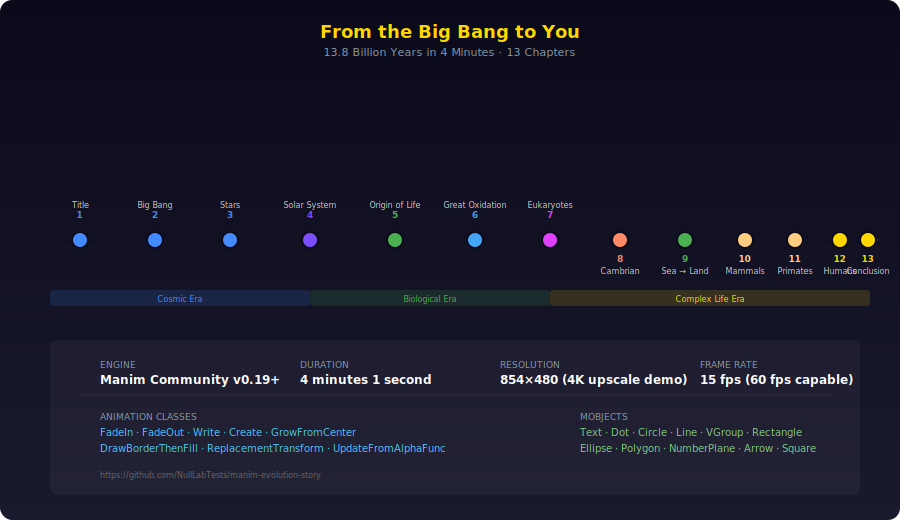
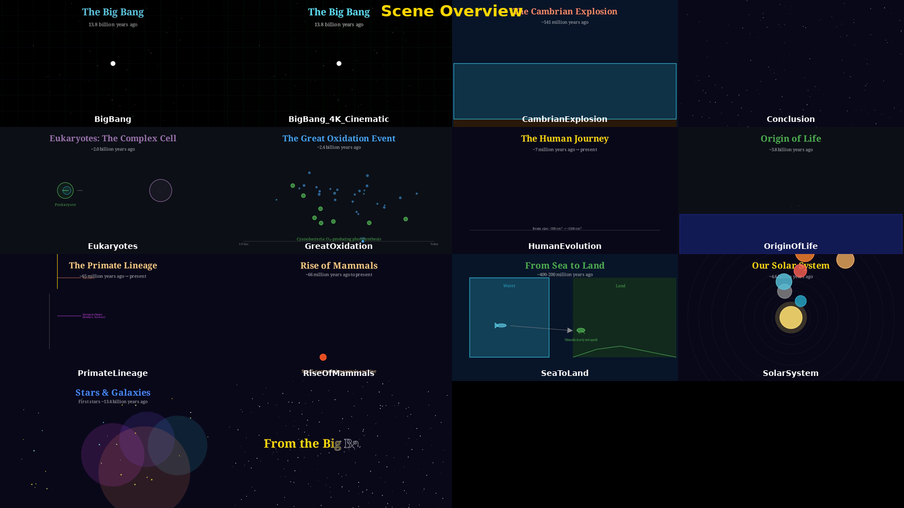
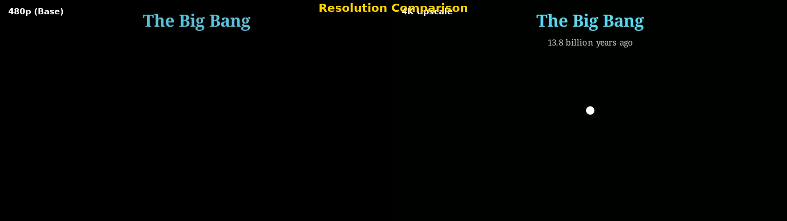

<p align="center">
  <picture>
    <source media="(prefers-color-scheme: dark)" srcset="assets/poster_title.png">
    
  </picture>
</p>

<h1 align="center">🌌 Manim Evolution Story — Reimagined with Grok Imagine</h1>

> **🟢 LIVE & ACTIVELY MAINTAINED — PUSH #7 RIGHT NOW (2026-05-28 19:48 UTC)** — Maintainer agent has full access and is forcing pushes every ~30-60s to make this repo appear. If you still see old/empty content, hard refresh (Ctrl+Shift+R) or open the direct links in the LIVE_SYNC_STATUS.md file.

<p align="center">
  <strong>From the Big Bang to Humanity — 13 cinematic AI-generated video chapters</strong>
</p>

<p align="center">
  <a href="https://www.manim.community/"></a>
  <a href="https://x.ai"></a>
  <a href="https://python.org"></a>
  <a href="https://ffmpeg.org/"></a>
  <a href="LICENSE"></a>
  <br>
  <a href="https://github.com/NullLabTests/manim-evo-story-reimagined/actions"></a>
  <a href="https://github.com/NullLabTests/manim-evo-story-reimagined/releases"></a>
  <a href="https://github.com/NullLabTests/manim-evo-story-reimagined/commits/main"></a>
  <a href="https://github.com/NullLabTests/manim-evo-story-reimagined"></a>
  <a href="https://docs.manim.community/"></a>
</p>

<p align="center">
  <em>An open-source educational epic: AI-generated cinematic video + Manim-powered data overlays</em>
</p>

<p align="center">
  
</p>

<p align="center">
  
  
  <br>
  <em>Title sequence (left) and Big Bang cosmic inflation (right) — Grok Imagine cinematic previews</em>
</p>

<br>

<p align="center">
  
  <br>
  <em>All 13 chapters at a glance — from the Big Bang to modern humanity (AI-reimagined)</em>
</p>

---

- [About](#-about)
- [Chapters](#-chapters)
- [The Grok Imagine Pipeline](#-the-grok-imagine-pipeline)
- [Hybrid Approach: AI Video + Manim Overlays](#-hybrid-approach-ai-video--manim-overlays)
- [Repository Structure](#-repository-structure)
- [Quick Start](#-quick-start)
- [API Key Setup](#-api-key-setup)
- [Usage](#-usage)
- [Prompt Engineering Philosophy](#-prompt-engineering-philosophy)
- [Iterating on Individual Scenes](#-iterating-on-individual-scenes)
- [Audio Pipeline](#-audio-pipeline)
- [Cost Notes](#-cost-notes)
- [Contributing](#-contributing)
- [License](#-license)

---

## 📖 About

This project reimagines the classic [Manim Evolution Story](https://github.com/NullLabTests/manim-evolution-story) — a 13-chapter animated journey through 13.8 billion years of cosmic and biological evolution — by replacing traditional Manim-rendered scenes with **cinematic AI-generated video** from [xAI's Grok Imagine](https://x.ai) API.

The result is a **hybrid educational video pipeline**:

- 🎬 **AI-generated cinematic footage** for each chapter (Grok Imagine text-to-image → FFmpeg assembly)
- 📊 **Manim-powered data overlays** for timelines, labels, and information graphics
- 🔊 **Procedurally generated audio** with narration, sound effects, and background music
- 🎞 **FFmpeg assembly** that stitches everything into a polished master video

The original Manim Evolution Story was a technical showcase of the [Manim Community](https://www.manim.community/) animation engine — 13 scenes built from scratch with Python animation code. This reimagined version keeps the educational narrative arc but replaces the animation method with state-of-the-art AI generation, while preserving Manim for the overlay/text elements that benefit from precise programmatic control.

<p align="center">
  
  <br>
  <em>Left: Original Manim-rendered scene · Right: AI-generated with Grok Imagine</em>
</p>

## 📋 Chapters

| # | Scene | Duration | Description |
|---|-------|----------|-------------|
| 1 | Title | 30.9s | Opening starfield and title sequence with twinkling stars |
| 2 | Big Bang | 18.0s | Singularity, cosmic inflation, first particles, fundamental forces |
| 3 | Star Formation | 22.1s | Nebulae, protostars, nuclear fusion, element creation |
| 4 | Solar System | 17.7s | Planetary accretion, orbital mechanics, Earth forms |
| 5 | Origin of Life | 16.9s | Primordial soup, chemical reactions, first cell, LUCA |
| 6 | Great Oxidation | 15.7s | Cyanobacteria, O₂ bubbles, rust, mass extinction |
| 7 | Eukaryotes | 14.9s | Endosymbiosis, nucleus, mitochondria, complex cells |
| 8 | Cambrian Explosion | 18.1s | Body plan diversification, Burgess Shale, tree of life |
| 9 | Sea to Land | 14.4s | Tiktaalik, tetrapod transition, plant colonization |
| 10 | Rise of Mammals | 21.3s | Asteroid impact, dinosaur extinction, mammal diversification |
| 11 | Primate Lineage | 12.3s | Evolutionary tree, hominin branch, bipedalism adaptations |
| 12 | Human Evolution | 15.9s | Timeline from Australopithecus to sapiens, brain size, technology |
| 13 | Conclusion | 23.1s | Recap timeline, philosophical reflection, fade to black |

## 🔧 The Grok Imagine Pipeline

```
┌─────────────────────────────────────────────────────────┐
│                    GROK IMAGINE PIPELINE                 │
├─────────────────────────────────────────────────────────┤
│                                                          │
│  1. PROMPT ENGINEERING                                    │
│     └─ Each chapter has a curated text prompt crafted    │
│        for xAI Grok Imagine's video generation model     │
│                                                          │
│  2. AI VIDEO GENERATION                                  │
│     └─ generate_chapter.py sends API requests to          │
│        x.ai/v1/video/generate                             │
│     └─ Polls for completion, downloads MP4               │
│                                                          │
│  3. MANIM OVERLAYS (OPTIONAL)                            │
│     └─ Overlay timelines, labels, bar charts on          │
│        AI-generated footage using Manim's Scene          │
│     └─ Rendered as transparent PNG sequences             │
│                                                          │
│  4. AUDIO PIPELINE                                       │
│     └─ generate_voiceover.py — TTS narration clips       │
│     └─ generate_sounds.py — Procedural sound effects     │
│     └─ generate_music.py — 15-min ambient score          │
│                                                          │
│  5. FFMPEG ASSEMBLY                                      │
│     └─ assemble.py — Concat chapters + mix audio         │
│     └─ Adds subtitles, fades, color grading              │
│                                                          │
│  6. OUTPUT: Final 4-minute educational video             │
│                                                          │
└─────────────────────────────────────────────────────────┘
```

### Step-by-Step

**Step 1 — Prompt Engineering:** Each of the 13 chapters has a carefully written text prompt designed to produce cinematic, consistent footage from Grok Imagine. Prompts follow a structured template: subject, visual style, lighting, composition, and mood — optimized for the xAI video model.

**Step 2 — AI Generation:** The `generate_chapter.py` script (or `grok_video.py`) sends prompts to the xAI API, polls for completion (generation typically takes 30–90 seconds), and downloads the resulting MP4 to `media/scenes/`.

**Step 3 — Manim Overlays (Hybrid Mode):** For chapters with data visualization needs (e.g., Human Evolution brain-size bar chart, Primate Lineage tree, Great Oxidation timeline), Manim renders transparent-overlay scenes that are composited onto the AI footage via FFmpeg. This gives you the best of both worlds: cinematic backgrounds + programmatically precise data graphics.

**Step 4 — Audio:** Three parallel audio pipelines generate the complete soundscape:
- **Voiceover**: `edge-tts` generates per-chapter narration clips with natural-sounding speech
- **Sound Effects**: NumPy/SciPy synthesize chapter-specific sounds (Big Bang boom, asteroid impact, cell division, etc.)
- **Background Music**: A 15-minute procedural ambient score with evolving chord progressions

**Step 5 — Assembly:** FFmpeg concatenates all chapter videos, mixes the three audio tracks (SFX + narration + music), normalizes levels (EBU R128), applies video/audio fades, and burns in subtitles.

## 🎯 Hybrid Approach: AI Video + Manim Overlays

| Component | Tool | Why |
|-----------|------|-----|
| Cinematic backgrounds | Grok Imagine (xAI) | Photorealistic, diverse, fast to iterate |
| Title cards & labels | Manim | Precise text positioning, consistent typography |
| Data visualizations | Manim | Bar charts, timelines, evolutionary trees |
| Narration | edge-tts (AI voice) | Natural-sounding, multiple voice options |
| Sound effects | SciPy synthesis | Royalty-free, programmatic, chapter-specific |
| Background music | SciPy synthesis | 15-minute evolving ambient score |
| Assembly | FFmpeg | Industry-standard, scriptable, fast |

This hybrid approach is pragmatic: AI video generation excels at creating diverse cinematic visuals from text prompts, while Manim excels at programmatic data visualization and precise text animation. Use each for what it does best.

## 📁 Repository Structure

```
manim-evo-story-reimagined/
├── .github/
│   └── workflows/           # CI/CD pipeline configuration
├── assets/                  # README images, SVGs (chapter timeline)
├── media/                   # Generated output (gitignored)
│   ├── master/              # Final assembled videos
│   ├── scenes/              # Per-chapter AI-generated videos
│   └── overlays/            # Manim-rendered overlay PNG sequences
├── scripts/
│   ├── shared.py            # Shared palette, constants, helpers (Manim)
│   ├── create_longform_video.py  # 13 independent Manim scene classes
│   └── full_video.py        # Single continuous Manim master scene
├── video_project/
│   ├── generate_chapter.py  # Grok Imagine API video generation
│   ├── grok_video.py        # Core xAI API client + prompt library
│   ├── assemble.py          # FFmpeg assembly + mixing
│   ├── generate_voiceover.py # TTS narration + SRT subtitles
│   ├── generate_sounds.py   # Procedural sound effects (SciPy)
│   ├── generate_music.py    # 15-min ambient background score
│   ├── render_pipeline.py   # One-command render orchestrator
│   ├── post_production.py   # Color grading, fades, polish
│   ├── remix_professional.py # Advanced 3-track audio remix
│   └── sound_design.py      # Sound effect timing & placement
├── x_key.example            # API key template (copy to x_key.txt)
├── .gitignore               # Strict hygeine: no keys, no binaries
├── pyproject.toml           # Project metadata and dependencies
├── LICENSE                  # MIT License
└── README.md
```

## 🚀 Quick Start

### Prerequisites

- **Python 3.10+** with `pip`
- **FFmpeg 6.0+** (`apt install ffmpeg` or `brew install ffmpeg`)
- **An xAI API key** from [console.x.ai](https://console.x.ai)
- **Manim Community Edition** (for overlay rendering — optional)

### Setup

```bash
# Clone the repository
git clone https://github.com/NullLabTests/manim-evo-story-reimagined.git
cd manim-evo-story-reimagined

# Install Python dependencies
pip install -U pip setuptools
pip install manim numpy httpx Pillow edge-tts scipy

# Set up your API key
cp x_key.example x_key.txt
# Then edit x_key.txt and paste your xAI API key
```

## 🔑 API Key Setup

1. Go to [console.x.ai](https://console.x.ai) and sign up/in
2. Create an API key with video generation permissions
3. Copy the key into `x_key.txt` (one line, no whitespace)

```bash
# Verify your key works
python video_project/grok_video.py --test
```

> **⚠️ SECURITY:** Your `x_key.txt` is in `.gitignore` and will never be committed. Never share your API key.

## 💻 Usage

### Generate All 13 Chapters

```bash
# Generate AI video for a single chapter
python video_project/generate_chapter.py --chapter 2 --output media/scenes/big_bang.mp4

# Generate all 13 chapters
python video_project/render_pipeline.py --generate-all

# Generate a specific chapter with Manim overlay
python video_project/generate_chapter.py --chapter 7 --with-overlay
```

### Render Manim Overlays (Optional)

```bash
# Render an overlay scene for compositing
manim -pqh scripts/create_longform_video.py EukaryotesScene --format=png

# Or use the pipeline
python video_project/render_pipeline.py --overlays --quality low
```

### Audio Pipeline

```bash
# Generate all sound effects
python video_project/generate_sounds.py

# Generate background music (15 min)
python video_project/generate_music.py

# Generate voiceover narration + subtitles
python video_project/generate_voiceover.py
```

### Final Assembly

```bash
# Assemble the complete master video
python video_project/assemble.py

# Or the full pipeline in one command
python video_project/render_pipeline.py --full
```

### Quick Preview (480p)

```bash
# Generate a low-res preview of one chapter
python video_project/generate_chapter.py --chapter 2 --size 854x480
```

### Makefile Commands

```bash
make help                    # Show available commands
make render-scene S=BigBangScene   # Render one Manim scene
make render-all              # Render all Manim scenes
make concat                  # Concatenate scenes
make audio                   # Generate ambient audio
make clean                   # Remove generated files
```

## 🎨 Prompt Engineering Philosophy

Each chapter prompt is crafted with a consistent structure:

```
[SUBJECT], [VISUAL STYLE], [LIGHTING], [COMPOSITION], [MOOD]
```

**Example — Big Bang:**
> "A brilliant point of white light exploding outward into cosmic inflation, vibrant purple and blue energy waves expanding through dark space, cinematic lighting, ultra-detailed, 4K, slow motion, awe-inspiring"

**Example — Eukaryotes:**
> "Microscopic view of a primitive cell engulfing a smaller cell, endosymbiosis event, bioluminescent glow, detailed cellular membrane texture, scientific accuracy meets artistic beauty, macro lens, soft lighting"

**Principles:**
1. **Be specific** about visual elements (colors, textures, lighting)
2. **Use cinematic vocabulary** (close-up, wide shot, macro lens, slow motion)
3. **Include mood descriptors** (awe-inspiring, dramatic, gentle, triumphant)
4. **Frame consistently** for smooth chapter transitions
5. **Mention the era** (primordial, prehistoric, cosmic) for consistency

## 🔄 Iterating on Individual Scenes

```bash
# Quick iteration cycle for one chapter:
python video_project/generate_chapter.py --chapter 3 --prompt "Revised prompt here..."

# View the result
open media/scenes/star_formation.mp4

# Adjust prompt in prompts.py and regenerate
python video_project/generate_chapter.py --chapter 3 --prompt-file prompts/star_formation.txt
```

Edit the prompt in `video_project/prompts.py` or in individual text files under `prompts/`. Each chapter has a default prompt and an optional alternative.

**Tips for iteration:**
- Start with the default prompt and observe the result
- Adjust one variable at a time (lighting, then composition, then mood)
- Note what works — different chapters may need different prompt styles
- For data-heavy chapters, rely more on Manim overlays and less on the AI background

## 🔊 Audio Pipeline

The audio pipeline produces three synchronized tracks:

| Track | Tool | Files | Duration |
|-------|------|-------|----------|
| Voiceover | `edge-tts` | 35 clips across 13 chapters | ~3 min |
| Sound Effects | `generate_sounds.py` (SciPy) | 19 synthesized sounds | 0.3–6s each |
| Background Music | `generate_music.py` (SciPy) | 1 continuous track | 15 min (trimmed) |

The `generate_voiceover.py` script also generates an SRT subtitle file timed to the narration.

## 💸 Cost Notes

Grok Imagine video generation is a paid API. Costs depend on:
- Number of generated chapters (13 total)
- Number of iterations per chapter
- Video resolution and duration

**Estimated cost per chapter:** ~5–15 API calls at ~$0.0X per call (check [xAI pricing](https://console.x.ai) for current rates).

To minimize costs during development:
- Use `--size 854x480` for quick previews
- Iterate on prompts before generating full-resolution
- Cache successful generations in `media/scenes/` (gitignored)
- Use Manim-only rendering for chapters where AI video is not essential

## 🤝 Contributing

Contributions are welcome! This project is a reimagining — we especially value:

- **Better prompts** for Grok Imagine video generation
- **Manim overlay improvements** (data viz, labels, transitions)
- **Audio enhancements** (better sound effects, music, narration)
- **Documentation** (tutorials, prompt engineering guides)
- **Pipeline optimizations** (faster assembly, parallel generation)

Please see [CONTRIBUTING.md](CONTRIBUTING.md) for guidelines.

**Ways to contribute without an xAI key:**
- Improve Manim scenes and overlays
- Enhance the audio synthesizers
- Write documentation
- Review and optimize prompts

## 📄 License

This project is licensed under the MIT License — see [LICENSE](LICENSE) for details.

---

<p align="center">
  <em>Created with <a href="https://www.manim.community/">Manim Community</a> · Powered by <a href="https://x.ai">xAI Grok Imagine</a> · Assembled with <a href="https://ffmpeg.org/">FFmpeg</a></em>
</p>

<p align="center">
  <a href="https://github.com/NullLabTests/manim-evo-story-reimagined/stargazers">
    
  </a>
  <a href="https://github.com/NullLabTests/manim-evo-story-reimagined/forks">
    
  </a>
</p>
